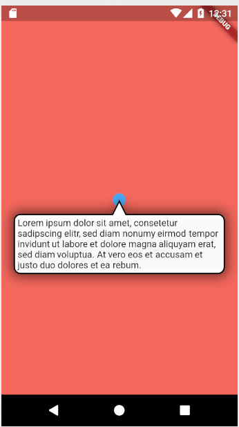
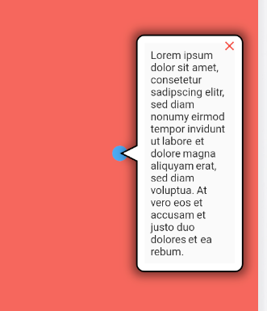
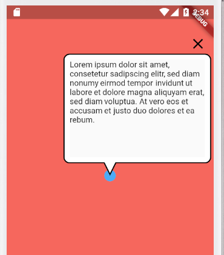
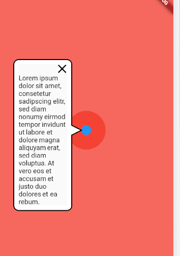
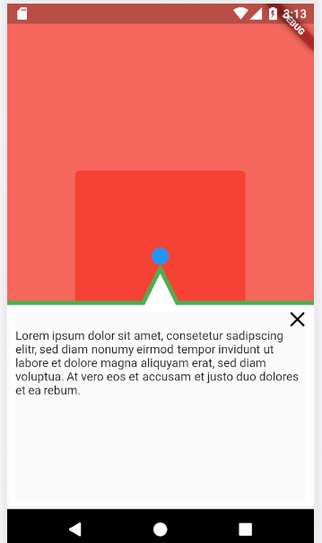

# super_tooltip

`SuperTooltip` is derived from a widget I wrote for a client. It is super flexible and allows you to display ToolTips in the overlay of the screen. The whole screen gets covered with a typically translucent background color. Tapping on the background closes the Tooltip.

My Client allowed me to publish this widget but currently you have to send him an email to get a commercial licence which will be given free if you aren't a competitor.

>AUTHOR
>
>Developed by Thomas Burkhart.
> 
>Concept and Copyright by Marcelo Glasberg.
>
>LICENSE
>
>GPL v3, for the moment. Will be changed to a commercially friendly license as soon >as possible. Meanwhile, please request a free commercially friendly license here: >marcglasberg @ gmail dot com. Most requests will be granted very quickly.





A tooltip has to be created inside a StatefulWidget that should be the target for the Tooltip it can be shown whenever you like. In the example we show it as a response of a TouchEvent.

```Dart
// We create the tooltip on the first use
tooltip = SuperTooltip(
  popupDirection: TooltipDirection.down,
  content: new Material(
      child: Text(
        "Lorem ipsum dolor sit amet, consetetur sadipscingelitr, "
        "sed diam nonumy eirmod tempor invidunt ut laboreet dolore magna aliquyam erat, "
        "sed diam voluptua. At vero eos et accusam et justoduo dolores et ea rebum. ",
    softWrap: true,
  )),
);

tooltip.show(context);
```

The the center of the passed `context` defines the target of the arrow of the tooltip.
As this widget as many features I won't list them all here. Please refer to the API docs and the source comments.
Instead I will show some of the features here. The first example was using all default values.


Let's add a red close button, making popup to the right and limit its width:



```Dart
// We create the tooltip on the first use
tooltip = SuperTooltip(
  popupDirection: TooltipDirection.right,
  maxWidth: 200.0,
  showCloseButton: ShowCloseButton.inside,
  closeButtonColor: Colors.red,
  content: new Material(
      child: Padding(
        padding: const EdgeInsets.all(8.0),
        child: Text(
          "Lorem ipsum dolor sit amet, consetetur sadipscing elitr, "
          "sed diam nonumy eirmod tempor invidunt ut labore et dolore magna aliquyam erat, "
          "sed diam voluptua. At vero eos et accusam et justo duo dolores et ea rebum. ",
    softWrap: true,
  ),
);
```

Let's nail the bubble into a fixed position and move the close button to the outside and remove the shadow



```Dart
tooltip = SuperTooltip(
  popupDirection: TooltipDirection.up,
  top: 50.0,
  right: 5.0,
  left: 100.0,
  showCloseButton: ShowCloseButton.outside,
  hasShadow: false,
  content: new Material(
      child: Padding(
        padding: const EdgeInsets.all(0.0),
        child: Text(
          "Lorem ipsum dolor sit amet, consetetur sadipscing elitr, "
          "sed diam nonumy eirmod tempor invidunt ut labore et dolore magna aliquyam erat, "
          "sed diam voluptua. At vero eos et accusam et justo duo dolores et ea rebum. ",
    softWrap: true,
  ),
      )),
);
```


Maybe you want to allow the user to touch an area below the overlay without closing the Tooltip? Open the area around the target this is quite easy. Additional we now open to the left and moved the tip of the arrow a bit away from the target:




```Dart

// Get the center of our target as global coordinates relative to overlay coordinates:
RenderBox renderBox = context.findRenderObject();
final RenderBox overlay = Overlay.of(context).context.findRenderObject();
var targetGlobalCenter =
    renderBox.localToGlobal(renderBox.size.center(Offset.zero), ancestor: overlay);


tooltip = SuperTooltip(
  popupDirection: TooltipDirection.left,
  top: 150.0,      
  left: 30.0,
  arrowTipDistance: 10.0,
  showCloseButton: ShowCloseButton.inside,
  closeButtonColor: Colors.black,
  closeButtonSize: 30.0,
  hasShadow: false,
  touchThrougArea: new Rect.fromCircle(center:targetGlobalCenter, radius: 40.0),
  content: new Material(
      child: Padding(
        padding: const EdgeInsets.only(top:20.0),
        child: Text(
          "Lorem ipsum dolor sit amet, consetetursadipscing elitr, "
          "sed diam nonumy eirmod tempor invidunt utlabore et dolore magna aliquyam erat, "
          "sed diam voluptua. At vero eos et accusam etjusto duo dolores et ea rebum. ",
    softWrap: true,
  ),
);
```

If you want the ToolTip to cover the maximum vertical available space, just set `snapsFarAwayVertically: true`. Also we can made the border green and thicker.



```Dart
tooltip = SuperTooltip(
   popupDirection: TooltipDirection.left,
   arrowTipDistance: 15.0,
   arrowBaseWidth: 40.0,
   arrowLength: 40.0,
   borderColor: Colors.green,
   borderWidth: 5.0,
   snapsFarAwayVertically: true,
   showCloseButton: ShowCloseButton.inside,
   hasShadow: false,
   touchThrougArea: new Rect.fromLTWH(targetGlobalCenter.dx-100,targetGlobalCenter.dy-100, 200.0, 160.0),
   touchThroughAreaShape: ClipAreaShape.rectangle,
   content: new Material(
       child: Padding(
         padding: const EdgeInsets.only(top:20.0),
         child: Text(
           "Lorem ipsum dolor sit amet, consetetur sadipscing elitr, "
           "sed diam nonumy eirmod tempor invidunt ut labore et dolore magna aliquyamerat, "
           "sed diam voluptua. At vero eos et accusam et justo duo dolores et earebum. ",
     softWrap: true,
   ),
```
